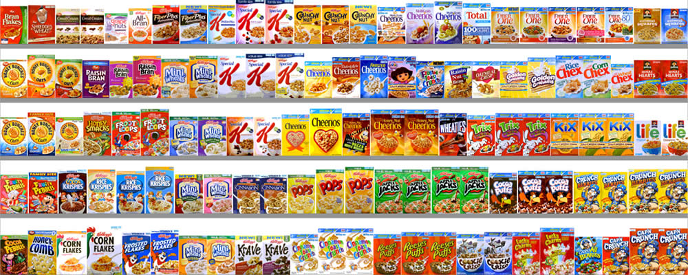

# Filters, convolutions, and cross-correlation

## Part 1. Convolutions

### Task #1

Implement `conv_nested` function that is a naive implementation of convolution which uses 4 nested for-loops. It takes an image `I` and a kernel `k` as inputs and outputs the convolved image `f○h` that has the same shape as the input image. Assume that pixels that outside of source images borders have intensity 0. Test your `conv_nested` function on a real image using gaussian kernel (3x3).

## Part 2. Cross-correlation

### Task #2

Cross-correlation can be used to look for templates in images. Implement finding the template on the shelf using cross-correlation.

`Note!` The template is located in the 1st row of the shelf (the 2nd element from the left).

`Question.` Is it able to detect the template correctly?

  
Answer

  
  _No, it cannot properly detect the template. The actual place is far away ..._

---

_Shelf_:

_Template_:

### Task #3 (optional)
In previous task try implementing zero-mean cross-correlation (subtract the mean value of the template so that it has zero mean).

  
Solution

  
  See [find_favorite examples](examples/find_favorite.ipynb).

### Task #4 (optional)
Modify the algorithm for cases of variable light conditions using __normalized cross-correlation__ (normalize the pixels of the image and template at every step before comparing them). Test on dark shelf.

_Dark shelf_:

